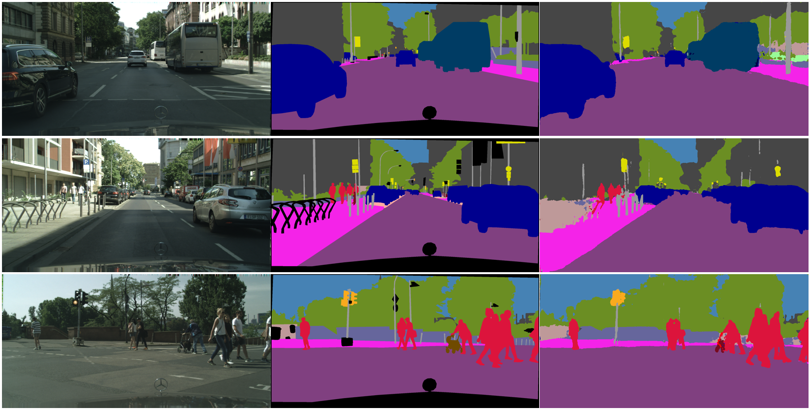

# RefineNet: a Keras implementation

> **NOTE**: I stopped using Keras a while ago and as such am no longer supporting this repo. Also, I recommend everybody to try PyTorch.

> **KNOWN ISSUE**: For some unknown reason the model gets stuck in some local minimum during training and predicts everything as black. If you encounter this issue, sorry! I don't know the answer. If you figure out a solution please add a pull request.

Paper: https://arxiv.org/abs/1611.06612

ResNet-101 frontend model from [flyyufelix's gist](https://gist.github.com/flyyufelix/65018873f8cb2bbe95f429c474aa1294).



---

# Usage
> **WARNING**: The pre-trained weights provided in the links below are not compatible with the current version of the model! To use the weights, checkpout an earlier version of the repo (which has the old, incorrect model architecture) or train your network from scratch.

ResNet-101 weights can be downloaded [here](https://my.syncplicity.com/share/m1qj80sthgfalaz/resnet101_weights_tf).
Pre-trained weights for CityScapes can be downloaded [here](https://my.syncplicity.com/share/cptvaesdqgw49vf/refinenet_baseline).

## Dataset directory structure
Image labels should be provided in RGB format, accompanied by a class dictionary.
Structure your dataset in the following way:
- `Dataset name`
  - `class_dict.csv`
  - `training`
    - `images`
	- `labels`
  - `validation`
    - `images`
	- `labels`
  - `testing`
    - `images`
	- `labels`
	
The `class_dict.csv` file should have the following structure (example for Cityscapes dataset):
```
name,r,g,b
road,128,64,128
sidewalk,244,35,232
building,70,70,70
wall,102,102,156
fence,190,153,153
pole,153,153,153
traffic_light,250,170,30
traffic_sign,220,220,0
vegetation,107,142,35
terrain,152,251,152
sky,70,130,180
person,220,20,60
rider,255,0,0
car,0,0,142
truck,0,0,70
bus,0,60,100
on_rails,0,80,100
motorcycle,0,0,230
bicycle,119,11,32
void,0,0,0
```
The last class (void in this case) will be ignored during both training and evaluation.

## Training model
1. Specify paths to `resnet101_weights_tf.h5` and your dataset base directory in `train.py`.
1. Run `train.py`. Logs, weights and all other files will be generated in a new `runs` directory.

## Inference
1. Obtain a pre-trained weights file: either download one [here](https://my.syncplicity.com/share/ncaetzxpebjtiyb/weights.35-0.14) (CityScapes) or train your own network.
1. Specify paths to `resnet101_weights_tf.h5`, RefineNet weights file and your dataset base directory in `inference.py`.
1. Run `inference.py`. Prediction results and original images will be placed into a new `predictions` directory.

---

# Performance
Performance evaluated on the CityScapes dataset.

| Class | IoU | nIoU |
| --- | --- | --- |
| **average** | **0.666** | **0.412** |
| bicycle | 0.652 | 0.454 |
| building | 0.895 | NaN |
| bus | 0.737 | 0.430 |
| car | 0.921 | 0.808 |
| fence | 0.445 | NaN |
| motorcycle | 0.466 | 0.229 |
| person | 0.708 | 0.487 |
| pole | 0.485 | NaN |
| rider | 0.491 | 0.272 |
| road | 0.972 | NaN |
| sidewalk | 0.779 | NaN |
| sky | 0.933 | NaN |
| terrain | 0.580 | NaN |
| traffic light | 0.492 | NaN |
| traffic sign | 0.639 |  NaN |
| train | 0.430 | 0.312 |
| truck | 0.688 | 0.305 |
| vegetation | 0.901 | NaN |
| wall | 0.441 | NaN |
